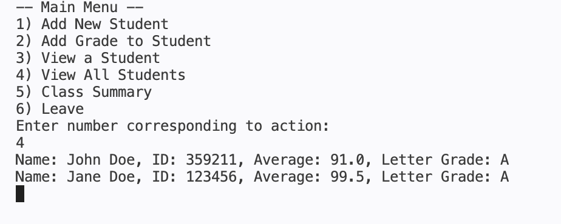

# Simple Grade Book
***
## About
Simple Grade Book is a program that allows you to manage a collection of students! You can add a new student; add a grade to a student; view individuals, all students, or a summary of the class!

What the code looks like when running!

## How to Use
***
1. Go to the 'main.py' file
2. Hit the run button
3. Follow given instructions!

## Project Features
***
- Multiple Classes
- A CSV to save all students and their corresponding information
- Print statements to look like typing
- Terminal clearing, so there are no walls of text
- Time delays to let you read stuff

## Contributors
***
- Lizzie42-SandersonFan